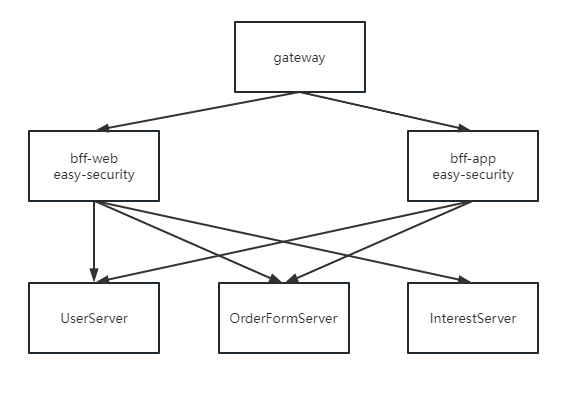
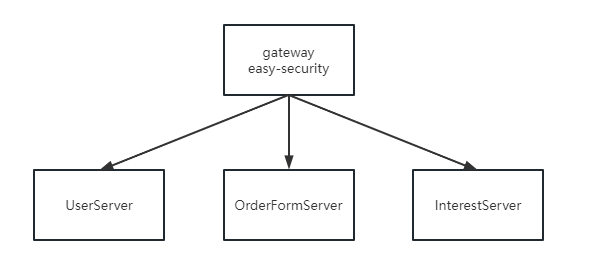
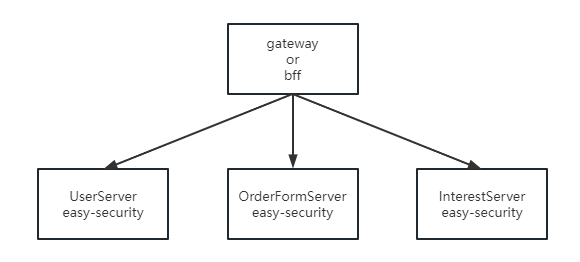

# easy-security


easy-security 基于过滤器实现的一款配合spring快速开发的安全认证框架，思想是希望通过简单的配置，并且实现核心的方法达到认证和鉴权的目的。

easy-security 不限制存取token方式，无论是保存到服务端还是使用JWT等都可以，因为这部分是由开发者自己来定义的，只需要告诉 easy-security 该如何获取用户信息即可。

如果你使用了 easy-security 自身所带的 Req 请求封装，那么所有的接口请求均以POST方式，Req 会把认证后的用户所携带在每次请求中，当需要获取用户的时候可以通过 Req 直接获取，解耦开发者获取认证用户的

easy-security 结合了 Yapi 的使用，如果你使用 Yapi需要在自己的项目中描述规则

### 使用模式
easy-security 可以兼容多种架构模式搭配，如下如：



gateway和bff的这种搭配，easy-security 可以在两个bff实现不同的认证逻辑，也可以实现相同的认证逻辑，但是权限可能是不一样，在web我拥有web的相关权限，app 拥有 app的相关权限。



单独 gateway 的模式，也可以是单独 bff的模式，这种模式就是只会有一种形式的，但只有一种就没必要有bff了。



每个 server 也可以有，也就是当每个server但被单独做成一个较大的服务，提供了自主的业务给不同用户的时候，都可以单独拥有认证和授权机制，当认证模式不统一的时候，那么我们可能需要额外的一个服务进行认证方式的统一做单点登录（SSO），若统一的话本身就支持了SSO

目前 gateway 和 gateway-bff 两种模式，子服务依然要引入 easy-security，因为要使用提供的 Req 服务，但可以不给开启和实现认证逻辑

### 功能列举
* 认证拦截
* 权限校验
* 用户获取
* 黑名单
* 密文传输(内置AES加密算法)

### 使用
1. 配置
```
easy
  security:
    # 开启认证
    auth-enable: true
    # 开启鉴权
    authorize-enable: true
    # 开启只有装成RequestData请求类
    request-data-enable: true
    # 项目路径，不会被认证
    project-url: 
      - /sysUser/login
      - /goods/getIndex
      - /goods/getGoodsInfo
    # 需要解密的路径
    decrypt-url: ""
    # 特殊路径，不受认证鉴权以及 Req 的影响
    special-url: 
      - /oss/**
    # 黑名单
    black-list: 
      - 192.168.148.42
      - 192.168.148.41
```

2. 实现获取方式
```
@Service
@Slf4j
public class AuthConfig implements EasySecurityServer {
    
    // 描述用户获取的方式，可以用token从redis获取，自己实现，也可以是JWT自己解析
    @Override
    public Object getAuthUser(String token) throws BasicException{
        JWT jwt = JWT.of(token);
        // 验证
        if(!jwt.setKey(key.getBytes()).verify()){
            throw new BasicException(BasicCode.BASIC_CODE_99986);
        }
        // 是否失效
        Long exp = Long.valueOf(jwt.getPayload("exp").toString());
        if(System.currentTimeMillis() > exp){
            throw new BasicException(BasicCode.BASIC_CODE_99985);
        }
        // 返回用户
        User user = new User();
        user.setId(jwt.getPayload("id").toString());
        user.setName(jwt.getPayload("name").toString());
        user.setUrl((List<String>) jwt.getPayload("url"));
        return user;
    }

    // 描述用户更获取权限集，可以用token从redis获取，自己实现
    // 也可以使用JWT自己解析数据
    @Override
    public List<String> getAuthorizeUrl(String token) throws BasicException{
        User authUser = (User) getAuthUser(token);
        return authUser.getUrl();
    }

}
```

3. 获取用户
```
// Req<T,U> 第一个参数为前端所传参数，第二个为后端会获取到的用户数据，只有登录了才能获取到
@PostMapping("/login")
public Rep<User> login(){
    User user = new User();
    user.setId("1");
    user.setName("张三");
    String token = JWT.create()
            .setPayload("id",1)
            .setPayload("name","张三")
            .setPayload("exp", System.currentTimeMillis()+60*60*1000)
            .setPayload("url", Arrays.asList("/test/abc"))
            .setKey(key.getBytes())
            .sign();
    user.setToken(token);
    return Rep.ok(user);
}

@PostMapping("/abc")
public Rep<String> test(@RequestBody Req<Object,User> req){
    String str = req.getData().toString();
    User user = req.getUser();
    return Rep.ok(user.getName());
}

req.getData() // 获取前端传参
req.getUser() // 获取操作用户
```

### Yapi规则描述
在项目中的 application.yml 文件里面添加如下：
```
field:
  required: "@com.aizuda.easy.security.annotation.yapi.YApiRule#required"
  default:
    value: "#default"
json:
  rule:
    field:
      ignore: "@com.aizuda.easy.security.annotation.yapi.YApiRule#hide"

method:
  additional:
    header[!@com.aizuda.easy.security.annotation.yapi.YApiRule]: '{name: "token",value: "ddb9ba4f842529e539560b0a6df23408de27dbed00860a1c3c5af04d44fa3c39",required: true}'
```
yapi 官方文档 https://hellosean1025.github.io/